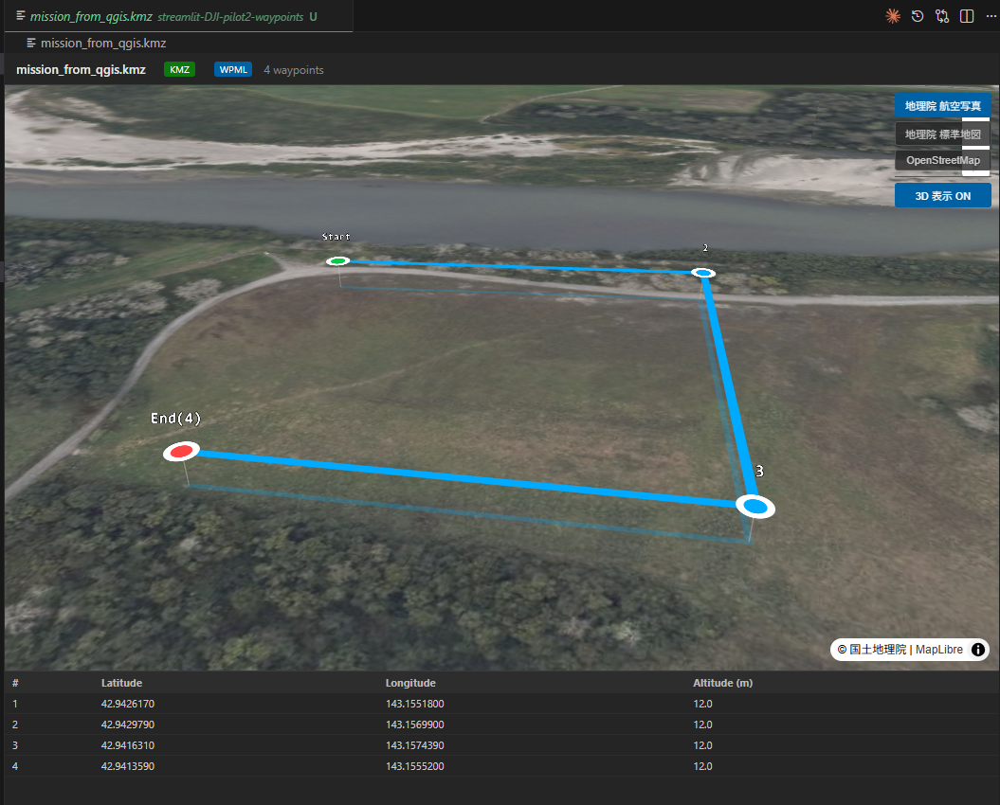

# vscode-dji-pilot2-tools

DJI Pilot 2 ミッションファイルの開発支援ツール VSCode 拡張機能です。

## スクリーンショット



## 機能

### KMZ ビューア

DJI Pilot 2 のミッションファイル（.kmz）を VSCode 上でインタラクティブ 3D マップ表示します。

- `.kmz` ファイルをダブルクリックするだけで自動表示（カスタムエディタ統合）
- **MapLibre GL JS** + **deck.gl** による 3D ウェイポイント表示
  - ウェイポイントを実際の高度（MSL）で 3D 空間にプロット
  - 地面との垂直ドロップライン表示
  - 飛行経路を 3D ラインで描画、進行方向の矢印付き
  - Start / End ラベル、ウェイポイント番号表示
- ベースマップ切替（地理院 航空写真 / 地理院 標準地図 / OpenStreetMap）
- 3D 表示 ON/OFF 切替
- ウェイポイントクリックで属性テーブルの対応行をハイライト
- 全ウェイポイントの座標・高度をテーブル表示
- `waylines.wpml` 同梱ファイルを WPML バッジで表示
- DJI Pilot 2 KMZ フォーマット（`template.kml` + `waylines.wpml`）に対応

**使い方:**
- エクスプローラーで `.kmz` ファイルを**ダブルクリック**
- または右クリック → **「DJI Pilot 2: Open KMZ Viewer」**

## 対応フォーマット

| フォーマット | 状態 |
|---|---|
| `.kmz`（DJI Pilot 2） | 対応済み |
| `template.kml` | 対応済み（ウェイポイント座標抽出） |
| `waylines.wpml` | 実装予定 |

## 姉妹プロジェクト

| リポジトリ | 説明 |
|---|---|
| [streamlit-DJI-pilot2-waypoints](https://github.com/shinyanakashima/streamlit-DJI-pilot2-waypoints) | Streamlit Web アプリ（GeoJSON → KMZ 変換） |
| [qgis-DJI-pilot2-waypoints](https://github.com/shinyanakashima/qgis-DJI-pilot2-waypoints) | QGIS プラグイン版 |

## 開発

### 前提環境
- Node.js 20+
- VSCode 1.85+

### セットアップ
```bash
npm install
npm run compile
```

VSCode で `F5` を押すと Extension Development Host が起動します。

## ライセンス

MIT
